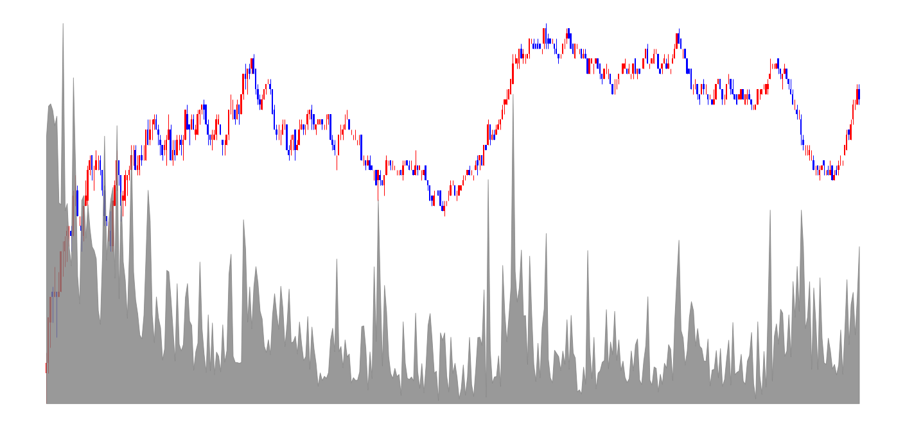

# 📈Kiwoom OpenAPI trading system
> **키움증권 OpenAPI를 활용한 자동거래 트레이딩 시스템**
> - 최초 제작시기 : 2023.04.31 (학부 4학년)
> - 모의투자 실행 : 2023.08 ~ 현재
> - 데이터 수집 기능 추가 : 2023.09.15

> **자동거래 동작 과정**
> 1. 개장 10분 전 윈도우 작업 스케줄러를 활용한 시스템 자동 실행
> 2. 개장 시간 동안 자동으로 거래를 수행
> 3. 장 마감 이후 다음날 거래 수행을 위한 대상 종목 탐색
 
> **분석기능**
> - 자동거래를 위한 종목 탐색(급등 종목, 거래량 급증 종목 등)
> - 선물거래 1분봉 수집
> - 개별 종목 데이터 수집

